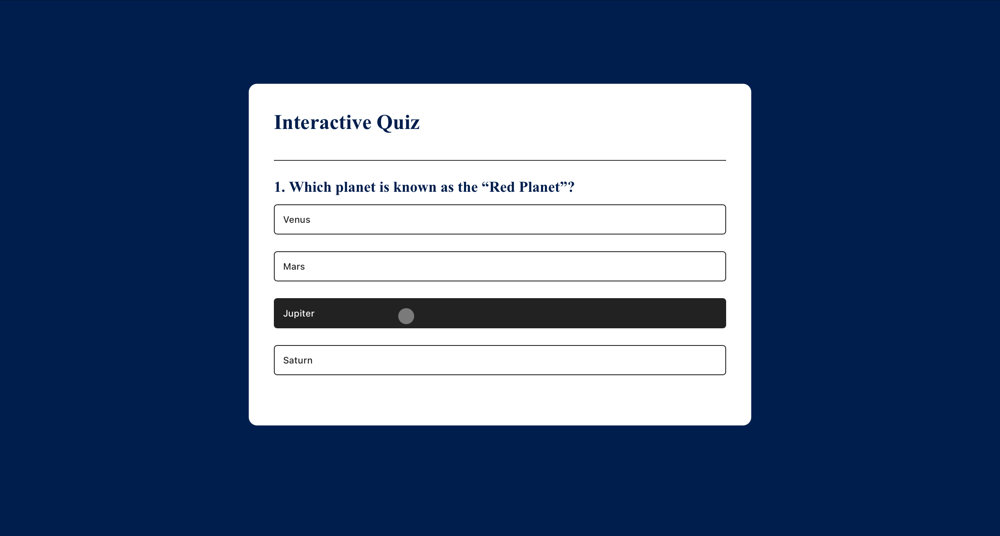
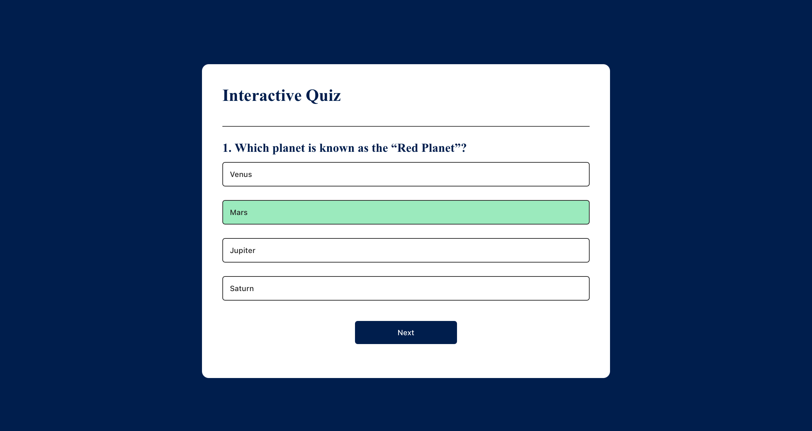
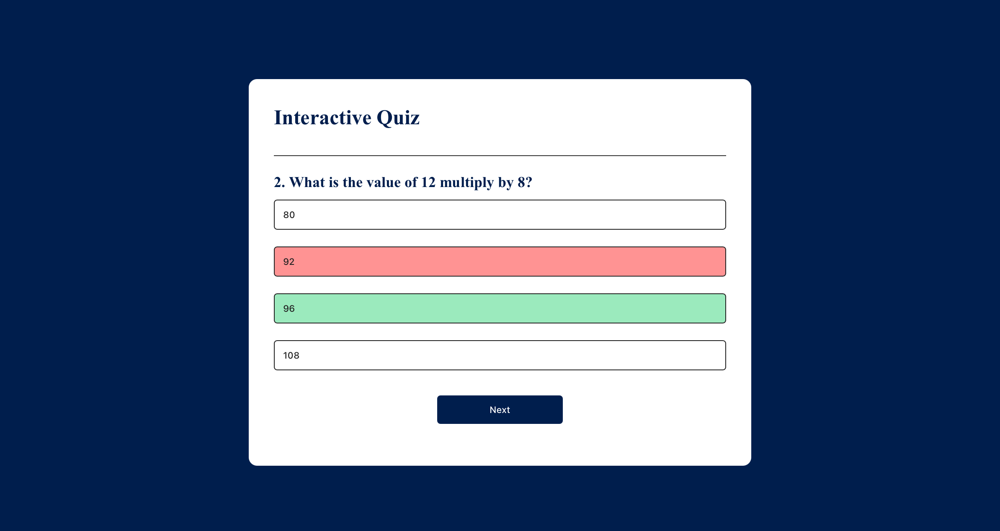

# Task  — Interactive Quiz App

A simple 5-question MCQ Quiz App with single-choice answers.  
Shows score and highlights correct/incorrect answers.

## Live Demo
👉 [Deployed Link Here]( https://merazkhan23b.github.io/Interactive-Quiz-App/)

## Features
- 5 questions, 4 options each
- Single-choice answers
- Play again button to Play again 
- Shows which answers were correct as Green colour / incorrect as Red colour.

## How to Run
1. Clone or download the repository.
2. Open `index.html` in a browser.

## Deployment steps
1.Push your code to GitHub
2.Go to repository Settings → Pages
3.Select the source branch
4.Save changes
5.Wait for deployment
6.Test your site
7.Add the live link to README.md

## Screenshots

### Home Page 

### Shows Correct answer as Green Colour 

### Shows which answers was correct as Green colour / incorrect as Red colour.

### After finishing the Quiz

